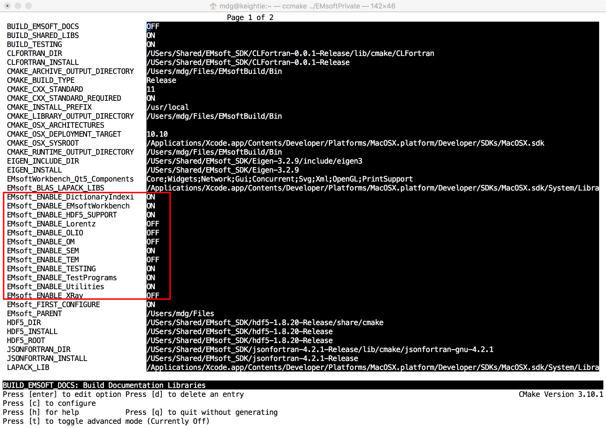

## Compiling sections of EMsoft

EMsoft contains a large number of programs for a number of electron scattering modalities as well as other modalities (optical microscopy, XRD, ...). Compilation of different modalities can be controlled by means of *CMake* switches that can be accessed readily using the *ccmake* program. When the following command is executed inside the *EMsoftBuild/Release* folder in a command window:

```fortran
  ccmake ../../EMsoft
```
a simple interface showing name-value pairs appears; a screen shot of the interface on Mac OS X is shown here: 



The parameters are listed on the left, their values on the right inside the dark background box. Use the arrow keys to navigate the cursor to a particular value field; hit *enter* to activate editing of the field if it is a text field, or to toggle its value between all possible values. In an editable field, press *enter* again to leave editing mode.  The red box outlines a number of switches that can be used to control compilation; for instance, to turn compilation of TEM programs off, navigate to the *EMsoft\_enable\_TEM* switch and toggle its value to *OFF*.  When all parameters have been set correctly, hit the *c*-key to configure, then the *g*-key to generate the new make files; if any asterisks appear in front of value fields, press the *c*-key again until no more asterisks are present. The program will terminate when the generation process ends; recompile the EMsoft package using *make -j* or *nmake*, depending on your platform. If only EBSD dictionary indexing is needed, it is sufficient to turn all switches to *OFF*, except for *EMsoft\_enable\_DictionaryIndexing*, *EMsoft\_enable\_SEM*, *EMsoft\_enable\_HDF5\_SUPPORT*, and *EMsoft\_enable\_Utilities*.

To activate the compilation of the *EMsoftWorkbench*, toggle the corresponding  *EMsoft\_enable\_EMsoftWorkbench* parameter to *ON*; note that this requires that the Qt library has been installed in the SDK.
